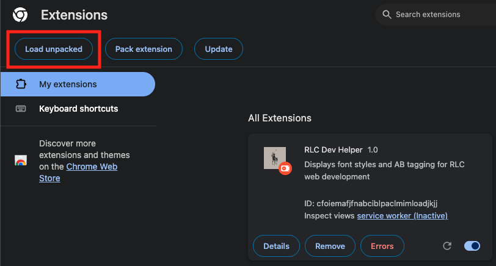

### Installation

1. **Clone or Download the Repository**
   ```bash
   git clone https://github.com/Suprefuner/rl-dev-helper.git

2. **Open Chrome Extension Settings**
- Go to [chrome://extensions/](chrome://extensions/) in your browser.
- Enable Developer mode (toggle in the top right corner).

3. **Load the Extension Locally**
- Click "Load unpacked".

- Select the folder where you cloned or extracted this repository.

You're Done! 🎉
The extension should now appear in your Chrome toolbar or extensions list.

### How to use
Hotkeys Setup for activate extension: (Optional)
1. Go to [chrome://extensions/shortcuts](chrome://extensions/shortcuts)
2. Find RLC Dev Helper
3. Assign your custom hot key

Built-in Hotkeys
| Key | Function |
|-----|----------|
| ` | Toggle Dev Helper menu |
| 1 | Trigger CGID/PID inspector |
| 2 | Trigger font inspector |
| 3 | Trigger image information inspector |
| 4 | Trigger video inspector |
| 5 | Trigger product color inspector |
| 6 | Trigger missing image inspector |
| 7 | Trigger PLP slot CA inspector |
