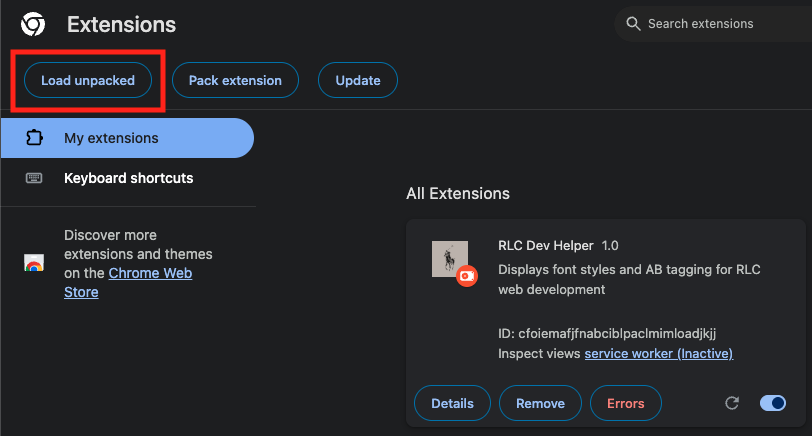
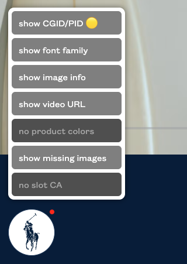

### Installation

1. **Clone or Download the Repository**
   ```bash
   git clone https://github.com/Suprefuner/rl-dev-helper.git

2. **Open Chrome Extension Settings**
- Go to [chrome://extensions/](chrome://extensions/) in your browser.
- Enable Developer mode (toggle in the top right corner).

3. **Load the Extension Locally**
- Click "Load unpacked".

- Select the folder where you cloned or extracted this repository.

You're Done! 🎉
The extension should now appear in your Chrome toolbar or extensions list.

### How to use
Hotkeys Setup for activate extension: (Optional)
1. Go to [chrome://extensions/shortcuts](chrome://extensions/shortcuts)
2. Find RLC Dev Helper
3. Assign your custom hot key

Built-in Hotkeys
| Key | Function |
|-----|----------|
| ` | Toggle Dev Helper menu |
| 1 | Toggle CGID/PID inspector |
| 2 | Toggle font inspector |
| 3 | Toggle image information inspector |
| 4 | Toggle video inspector |
| 5 | Toggle product color inspector |
| 6 | Toggle missing image inspector |
| 7 | Toggle PLP slot CA inspector |

### Update Log
#### [4/5/2026]
- **Feature**: Added **Product Preview** functionality.
Hover the product slice to preview. 

- **Logic Update**: 
  - Enhanced error checking to distinguish between all kinds of ID(CGID/PID) errors and PID-only errors.
  - **UI Change**: Displays a 🟡 instead of a 🔴 if only PID errors are detected.

